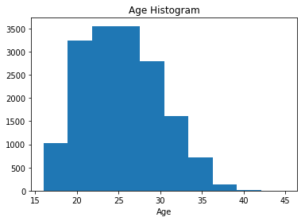
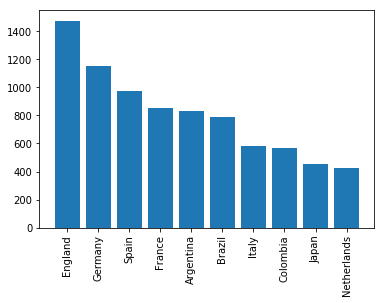
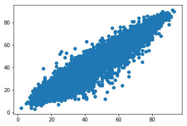

<h1 style='text-align:center'> Module 1 Assessment</h1>

This assessment is designed to test your understanding of the Mod 1 material. It covers:

* Python Fundamentals
* Working with Statistical Data
* Pandas and Numpy
* Data Visualization
* Linear Regression

Read the instructions carefully. You will be asked both to write code and respond to a few short answer questions.

#### Note on the short answer questions
For the short answer questions _please use your own words_. The expectation is that you have **not** copied and pasted from an external source, even if you consult another source to help craft your response. While the short answer questions are not necessarily being assessed on grammatical correctness or sentence structure, do your best to communicate yourself clearly.

## Python Fundamentals

In the first section, we will work with various Python data types and try to accomplish certain tasks using some Python fundamentals. Below, we've defined a dictionary with soccer player names as keys for nested dictionaries containing information about each players age, nationality, and a list of teams they have played for.   


```python
players = {
	'L. Messi': {
		'age': 31,
		'nationality': 'Argentina',
		'teams': ['Barcelona']
	},
	'Cristiano Ronaldo': {
		'age': 33,
		'nationality': 'Portugal',
		'teams': ['Juventus', 'Real Madrid', 'Manchester United']
	},
	'Neymar Jr': {
		'age': 26,
		'nationality': 'Brazil',
		'teams': ['Santos', 'Barcelona', 'Paris Saint-German']
	},
	'De Gea': {
		'age': 27,
		'nationality': 'Spain',
		'teams': ['Atletico Madrid', 'Manchester United']
	},
	'K. De Bruyne': {
		'age': 27,
		'nationality': 'Belgium',
		'teams': ['Chelsea', 'Manchester City']
	}
}
```


```python
# __SOLUTION__ 
players = {
	'L. Messi': {
		'age': 31,
		'nationality': 'Argentina',
		'teams': ['Barcelona']
	},
	'Cristiano Ronaldo': {
		'age': 33,
		'nationality': 'Portugal',
		'teams': ['Juventus', 'Real Madrid', 'Manchester United']
	},
	'Neymar Jr': {
		'age': 26,
		'nationality': 'Brazil',
		'teams': ['Santos', 'Barcelona', 'Paris Saint-German']
	},
	'De Gea': {
		'age': 27,
		'nationality': 'Spain',
		'teams': ['Atletico Madrid', 'Manchester United']
	},
	'K. De Bruyne': {
		'age': 27,
		'nationality': 'Belgium',
		'teams': ['Chelsea', 'Manchester City']
	}
}
```

**1) Create a `list` of all the keys in the `players` dictionary. Use python's documentation on dictionaries for help if needed. Store the list of player names in a variable called `player_names` to use in the next question.**


```python
# Get the list of all player names from the dictionary
player_names = None
```


```python
# __SOLUTION__ 
player_names = list(players.keys())
```


```python
# __SOLUTION__ 
print(player_names)
```

    ['L. Messi', 'Cristiano Ronaldo', 'Neymar Jr', 'De Gea', 'K. De Bruyne']


**2) Great! Now that we have each players name, let's use that information to create a `list` of `tuples` containing each player's name along with their nationality. Store the list in a variable called `player_nationalities`**


```python
# Generate list of tuples such that the first element in the tuple is 
# a players name and the second is their nationality 
# Ex: [('L. Messi', 'Argentina'), ('Christiano Ronaldo', 'Portugal'), ...]
player_nationalities = None
```


```python
# __SOLUTION__ 
player_nationalities = [(x, players[x]['nationality']) for x in player_names]
```


```python
# __SOLUTION__ 
print(player_nationalities)
```

    [('L. Messi', 'Argentina'), ('Cristiano Ronaldo', 'Portugal'), ('Neymar Jr', 'Brazil'), ('De Gea', 'Spain'), ('K. De Bruyne', 'Belgium')]


**3) Now, define a function called `get_players_on_team` that returns a `list` of the names of all the players who have played on a given team.** 

Your function should take two arguments: 
* a dictionary of player information
* a `string` of the team you are trying to find the players for 

**Be sure that your function has a `return` statement.**


```python
# Define your get_players_on_team function here.
```


```python
players_on_manchester_united = get_players_on_team(players,'Manchester United')
```


```python
# __SOLUTION__ 
def get_players_on_team(dict_,team_name):
    player_list = []
    for player in dict_:
        if team_name in dict_[player]['teams']:
            player_list.append(player)
    return player_list
```


```python
# __SOLUTION__ 
players_on_manchester_united = get_players_on_team(players,'Manchester United')
print(players_on_manchester_united)
```

    ['Cristiano Ronaldo', 'De Gea']


## Pandas and Numpy

In this section you will be doing some preprocessing and exploratory data analysis for a dataset for the videogame FIFA19 (https://www.kaggle.com/karangadiya/fifa19).  The dataset contains both data for the game as well as information about the players' real life careers.  You will be building toward running a regression. 

**1) Read the CSV file into a pandas dataframe**

The data you'll be working with is found in a file called './data/fifa.csv'.  Use your knowledge of pandas to create a new dataframe using the csv data. 

Check the contents of your dataframe with `df.head()`</b>


```python
import pandas as pd
import numpy as np
import warnings
warnings.filterwarnings('ignore')
```


```python
# __SOLUTION__ 
import pandas as pd
import numpy as np
import warnings
warnings.filterwarnings('ignore')
```


```python
df = None
df.head()
```


```python
# __SOLUTION__ 
df = pd.read_csv('./data/fifa.csv')
df.head()
```


<div>
<style scoped>
    .dataframe tbody tr th:only-of-type {
        vertical-align: middle;
    }

    .dataframe tbody tr th {
        vertical-align: top;
    }

    .dataframe thead th {
        text-align: right;
    }
</style>
<table border="1" class="dataframe">
  <thead>
    <tr style="text-align: right;">
      <th></th>
      <th>Unnamed: 0</th>
      <th>ID</th>
      <th>Name</th>
      <th>Age</th>
      <th>Photo</th>
      <th>Nationality</th>
      <th>Flag</th>
      <th>Overall</th>
      <th>Potential</th>
      <th>Club</th>
      <th>...</th>
      <th>Composure</th>
      <th>Marking</th>
      <th>StandingTackle</th>
      <th>SlidingTackle</th>
      <th>GKDiving</th>
      <th>GKHandling</th>
      <th>GKKicking</th>
      <th>GKPositioning</th>
      <th>GKReflexes</th>
      <th>Release Clause</th>
    </tr>
  </thead>
  <tbody>
    <tr>
      <th>0</th>
      <td>0</td>
      <td>158023</td>
      <td>L. Messi</td>
      <td>31</td>
      <td>https://cdn.sofifa.org/players/4/19/158023.png</td>
      <td>Argentina</td>
      <td>https://cdn.sofifa.org/flags/52.png</td>
      <td>94</td>
      <td>94</td>
      <td>FC Barcelona</td>
      <td>...</td>
      <td>96.0</td>
      <td>33.0</td>
      <td>28.0</td>
      <td>26.0</td>
      <td>6.0</td>
      <td>11.0</td>
      <td>15.0</td>
      <td>14.0</td>
      <td>8.0</td>
      <td>226500.0</td>
    </tr>
    <tr>
      <th>1</th>
      <td>1</td>
      <td>20801</td>
      <td>Cristiano Ronaldo</td>
      <td>33</td>
      <td>https://cdn.sofifa.org/players/4/19/20801.png</td>
      <td>Portugal</td>
      <td>https://cdn.sofifa.org/flags/38.png</td>
      <td>94</td>
      <td>94</td>
      <td>Juventus</td>
      <td>...</td>
      <td>95.0</td>
      <td>28.0</td>
      <td>31.0</td>
      <td>23.0</td>
      <td>7.0</td>
      <td>11.0</td>
      <td>15.0</td>
      <td>14.0</td>
      <td>11.0</td>
      <td>127100.0</td>
    </tr>
    <tr>
      <th>2</th>
      <td>2</td>
      <td>190871</td>
      <td>Neymar Jr</td>
      <td>26</td>
      <td>https://cdn.sofifa.org/players/4/19/190871.png</td>
      <td>Brazil</td>
      <td>https://cdn.sofifa.org/flags/54.png</td>
      <td>92</td>
      <td>93</td>
      <td>Paris Saint-Germain</td>
      <td>...</td>
      <td>94.0</td>
      <td>27.0</td>
      <td>24.0</td>
      <td>33.0</td>
      <td>9.0</td>
      <td>9.0</td>
      <td>15.0</td>
      <td>15.0</td>
      <td>11.0</td>
      <td>228100.0</td>
    </tr>
    <tr>
      <th>3</th>
      <td>3</td>
      <td>193080</td>
      <td>De Gea</td>
      <td>27</td>
      <td>https://cdn.sofifa.org/players/4/19/193080.png</td>
      <td>Spain</td>
      <td>https://cdn.sofifa.org/flags/45.png</td>
      <td>91</td>
      <td>93</td>
      <td>Manchester United</td>
      <td>...</td>
      <td>68.0</td>
      <td>15.0</td>
      <td>21.0</td>
      <td>13.0</td>
      <td>90.0</td>
      <td>85.0</td>
      <td>87.0</td>
      <td>88.0</td>
      <td>94.0</td>
      <td>138600.0</td>
    </tr>
    <tr>
      <th>4</th>
      <td>4</td>
      <td>192985</td>
      <td>K. De Bruyne</td>
      <td>27</td>
      <td>https://cdn.sofifa.org/players/4/19/192985.png</td>
      <td>Belgium</td>
      <td>https://cdn.sofifa.org/flags/7.png</td>
      <td>91</td>
      <td>92</td>
      <td>Manchester City</td>
      <td>...</td>
      <td>88.0</td>
      <td>68.0</td>
      <td>58.0</td>
      <td>51.0</td>
      <td>15.0</td>
      <td>13.0</td>
      <td>5.0</td>
      <td>10.0</td>
      <td>13.0</td>
      <td>196400.0</td>
    </tr>
  </tbody>
</table>
<p>5 rows × 89 columns</p>
</div>


**2) Check for duplicates**
    
**First, check how many columns and rows are in the dataset, then check how many unique values are in the "ID" column.**


```python
# code here to see the size of the dataframe

```


```python
# __SOLUTION__ 
# code here to see the size of the dataframe
df.shape
```


    (20000, 89)


```python
# code here to check number of unique ids

```


```python
# __SOLUTION__ 
# code here to check number of unique ids
df.ID.nunique()
```


    18207


<b> 3) Drop Duplicates
    
It looks like there are duplicates.  Get rid of them by dropping duplicate rows. After you have dropped them, see how many rows are remaining.</b>


```python
# code here

```


```python
# __SOLUTION__ 
# code here
df.drop_duplicates(subset=['ID'], inplace=True)
```


```python
# now see how many rows there are

```


```python
# __SOLUTION__ 
# now see how many rows there are
df.shape
```


    (18207, 89)


<b> 4. Drop n/a rows for "Release Clause"
    
Drop rows for which "Release Clause" is none or not given. This is part of a soccer player's contract dealing with being bought out by another team. Release Clause will be the target variable for our regression model.  After you have dropped them, see how many rows are remaining.</b>


```python
# code here to drop n/a rows

```


```python
# __SOLUTION__ 
# code here to drop n/a rows
df.dropna(subset=['Release Clause'],inplace=True)
```


```python
# now check how many rows are left 

```


```python
# __SOLUTION__ 
# now check how many rows are left 
df.shape
```


    (16643, 89)


<b> 5) Convert players' heights to inches. Replace the original height column.
First create a function, then use it on your dataframe. Create a function that convert a string into a integer and then apply that function to all of the height column.</b>


```python
# code here to write a helper function
def convert_height(height):
    '''
    inputs: height (string)
    ----
    returns: height in inches (int)
    '''
    pass
```


```python
# __SOLUTION__ 
# code here to write a helper function
def convert_height(height):
    split = height.split("'")
    return int(split[0])*12 + int(split[1])
```


```python
# test here
convert_height("5'7")
```


```python
# __SOLUTION__ 
# test here
convert_height("5'7")
```


    67


```python
# code here to use the function on the height column

```


```python
# __SOLUTION__ 
# code here to use the function on the height column
df['Height'] = df.Height.apply(lambda x: convert_height(x))
```

## Data Visualization

<b> 1) Make a histogram of players age
    
_Add a title and x axis label._ Use whichever plotting library you are most comfortable with. </b>


```python
import matplotlib.pyplot as plt
import seaborn as sns
%matplotlib inline
```


```python
# __SOLUTION__ 
import matplotlib.pyplot as plt
import seaborn as sns
%matplotlib inline
```


```python
# histogram

```


```python
# __SOLUTION__ 
# histogram
plt.hist(df.Age)
plt.title('Age Histogram')
plt.xlabel('Age')
```


    Text(0.5, 0, 'Age')





<b> 2) Make a bar chart for the 10 countries with the most players (by nationality)</b>

Make sure to include x labels on your chart!


```python
# code here to get the top 10 countries with the most players

```


```python
# __SOLUTION__ 
# code here to get the top 10 countries with the most players
df.Nationality.value_counts()[0:10].index
```


    Index(['England', 'Germany', 'Spain', 'France', 'Argentina', 'Brazil', 'Italy',
           'Colombia', 'Japan', 'Netherlands'],
          dtype='object')


```python
# code here to plot a bar chart
plt.subplots(figsize=(10,6))

```


```python
# __SOLUTION__ 
# code here to plot a bar chart
plt.bar(x= list(df.Nationality.value_counts()[0:10].index), height = list(df.Nationality.value_counts()[0:10].values))
plt.xticks(rotation='vertical')
```


    ([0, 1, 2, 3, 4, 5, 6, 7, 8, 9], <a list of 10 Text xticklabel objects>)





<b> 3) Make a scatter plot for the player stats StandingTackle and SlidingTackle

What can we say about these two features? </b>


```python
# code here to plot a scatterplot


```


```python
# __SOLUTION__ 
# code here to plot a scatterplot
plt.scatter(df['StandingTackle'], df['SlidingTackle'])

```


    <matplotlib.collections.PathCollection at 0x113e2d6d8>





```python
# Your written answer here
```


```python
# __SOLUTION__
# Your written answer here
# These two features are highly correlated.
```

### Exploring Statistical Data

We'll continue using the same FIFA 2019 dataset.  This section will assess your ability to use numpy and work with summary statistics.

<b>1) Convert the Release Clause Price from Euros to Dollars
    
Create a new column that has the 'release_clause' in dollars.

1.2 Dollars = 1 Euro.</b>


```python
# code here to convert the column of euros to dollarss

```


```python
# __SOLUTION__ 
# code here to convert the column of euros to dollarss
df['release_clause_dollars'] = df['Release Clause'] * 1.2
```

<b>2) Get summary statistics for all numeric columns
    
(Please don't do each column individually!)</b>


```python
# code here

```


```python
# __SOLUTION__ 
# code here
df.describe()
```


<div>
<style scoped>
    .dataframe tbody tr th:only-of-type {
        vertical-align: middle;
    }

    .dataframe tbody tr th {
        vertical-align: top;
    }

    .dataframe thead th {
        text-align: right;
    }
</style>
<table border="1" class="dataframe">
  <thead>
    <tr style="text-align: right;">
      <th></th>
      <th>Unnamed: 0</th>
      <th>ID</th>
      <th>Age</th>
      <th>Overall</th>
      <th>Potential</th>
      <th>Special</th>
      <th>International Reputation</th>
      <th>Weak Foot</th>
      <th>Skill Moves</th>
      <th>Jersey Number</th>
      <th>...</th>
      <th>Marking</th>
      <th>StandingTackle</th>
      <th>SlidingTackle</th>
      <th>GKDiving</th>
      <th>GKHandling</th>
      <th>GKKicking</th>
      <th>GKPositioning</th>
      <th>GKReflexes</th>
      <th>Release Clause</th>
      <th>release_clause_dollars</th>
    </tr>
  </thead>
  <tbody>
    <tr>
      <th>count</th>
      <td>16643.000000</td>
      <td>16643.000000</td>
      <td>16643.000000</td>
      <td>16643.000000</td>
      <td>16643.000000</td>
      <td>16643.000000</td>
      <td>16643.000000</td>
      <td>16643.000000</td>
      <td>16643.000000</td>
      <td>16643.000000</td>
      <td>...</td>
      <td>16643.000000</td>
      <td>16643.000000</td>
      <td>16643.000000</td>
      <td>16643.000000</td>
      <td>16643.000000</td>
      <td>16643.000000</td>
      <td>16643.000000</td>
      <td>16643.000000</td>
      <td>16643.000000</td>
      <td>1.664300e+04</td>
    </tr>
    <tr>
      <th>mean</th>
      <td>5422.904945</td>
      <td>213845.010094</td>
      <td>25.226221</td>
      <td>66.162771</td>
      <td>71.140900</td>
      <td>1595.383404</td>
      <td>1.114823</td>
      <td>2.942919</td>
      <td>2.349516</td>
      <td>19.657213</td>
      <td>...</td>
      <td>47.328967</td>
      <td>47.776302</td>
      <td>45.751607</td>
      <td>16.747521</td>
      <td>16.515712</td>
      <td>16.355765</td>
      <td>16.503936</td>
      <td>16.837409</td>
      <td>228201.273629</td>
      <td>2.738415e+05</td>
    </tr>
    <tr>
      <th>std</th>
      <td>2721.036613</td>
      <td>30546.285826</td>
      <td>4.716588</td>
      <td>7.008236</td>
      <td>6.151409</td>
      <td>275.723076</td>
      <td>0.398559</td>
      <td>0.659933</td>
      <td>0.755855</td>
      <td>16.054811</td>
      <td>...</td>
      <td>19.937220</td>
      <td>21.681809</td>
      <td>21.295201</td>
      <td>17.832273</td>
      <td>17.033907</td>
      <td>16.615668</td>
      <td>17.151713</td>
      <td>18.090985</td>
      <td>299251.865865</td>
      <td>3.591022e+05</td>
    </tr>
    <tr>
      <th>min</th>
      <td>0.000000</td>
      <td>16.000000</td>
      <td>16.000000</td>
      <td>46.000000</td>
      <td>48.000000</td>
      <td>731.000000</td>
      <td>1.000000</td>
      <td>1.000000</td>
      <td>1.000000</td>
      <td>1.000000</td>
      <td>...</td>
      <td>3.000000</td>
      <td>2.000000</td>
      <td>3.000000</td>
      <td>1.000000</td>
      <td>1.000000</td>
      <td>1.000000</td>
      <td>1.000000</td>
      <td>1.000000</td>
      <td>1000.000000</td>
      <td>1.200000e+03</td>
    </tr>
    <tr>
      <th>25%</th>
      <td>3175.500000</td>
      <td>199569.500000</td>
      <td>21.000000</td>
      <td>62.000000</td>
      <td>67.000000</td>
      <td>1452.000000</td>
      <td>1.000000</td>
      <td>3.000000</td>
      <td>2.000000</td>
      <td>8.000000</td>
      <td>...</td>
      <td>30.000000</td>
      <td>27.000000</td>
      <td>24.000000</td>
      <td>8.000000</td>
      <td>8.000000</td>
      <td>8.000000</td>
      <td>8.000000</td>
      <td>8.000000</td>
      <td>2500.000000</td>
      <td>3.000000e+03</td>
    </tr>
    <tr>
      <th>50%</th>
      <td>5488.000000</td>
      <td>221493.000000</td>
      <td>25.000000</td>
      <td>66.000000</td>
      <td>71.000000</td>
      <td>1633.000000</td>
      <td>1.000000</td>
      <td>3.000000</td>
      <td>2.000000</td>
      <td>17.000000</td>
      <td>...</td>
      <td>53.000000</td>
      <td>55.000000</td>
      <td>52.000000</td>
      <td>11.000000</td>
      <td>11.000000</td>
      <td>11.000000</td>
      <td>11.000000</td>
      <td>11.000000</td>
      <td>19800.000000</td>
      <td>2.376000e+04</td>
    </tr>
    <tr>
      <th>75%</th>
      <td>7770.000000</td>
      <td>236802.000000</td>
      <td>29.000000</td>
      <td>71.000000</td>
      <td>75.000000</td>
      <td>1787.000000</td>
      <td>1.000000</td>
      <td>3.000000</td>
      <td>3.000000</td>
      <td>26.000000</td>
      <td>...</td>
      <td>64.000000</td>
      <td>66.000000</td>
      <td>64.000000</td>
      <td>14.000000</td>
      <td>14.000000</td>
      <td>14.000000</td>
      <td>14.000000</td>
      <td>14.000000</td>
      <td>431000.000000</td>
      <td>5.172000e+05</td>
    </tr>
    <tr>
      <th>max</th>
      <td>9999.000000</td>
      <td>246620.000000</td>
      <td>45.000000</td>
      <td>94.000000</td>
      <td>95.000000</td>
      <td>2346.000000</td>
      <td>5.000000</td>
      <td>5.000000</td>
      <td>5.000000</td>
      <td>99.000000</td>
      <td>...</td>
      <td>94.000000</td>
      <td>93.000000</td>
      <td>91.000000</td>
      <td>90.000000</td>
      <td>92.000000</td>
      <td>91.000000</td>
      <td>90.000000</td>
      <td>94.000000</td>
      <td>999000.000000</td>
      <td>1.198800e+06</td>
    </tr>
  </tbody>
</table>
<p>8 rows × 47 columns</p>
</div>


<b>3) What is the mean age and the median age for the players in this dataset?  How are the mean and median related to each other?</b>


```python
# code here
```


```python
# __SOLUTION__ 
print(df['Age'].mean())
print(df['Age'].median())
```

    25.226221234152497
    25.0


```python
# Your written answer here
```


```python
# __SOLUTION__
"""
Mean age = 25.22 median age = 25

The average age of all players in the league is 25.22 years. 
The center of the dataset rests at 25. Since mean and median are pretty similar, 
age seems to be slightly skewed towards the older end of the spectrum.
"""
```

#### 4) Who is the oldest player in Argentina and how old is he?  


```python
# code here
```


```python
# __SOLUTION__ 
argentines = df.loc[df['Nationality'] == 'Argentina']

argentines.loc[argentines['Age'].idxmax(), ['Name', 'Age']]
```


    Name    C. Muñoz
    Age           41
    Name: 7225, dtype: object


```python
# Your written answer here
```


```python
# __SOLUTION__
# Your written answer here
# The oldest player in Argentina is C Muñoz, and he is 41 years old.
```

## Linear Regression

<b> 1) What are the covariance and correlation between "GKDiving" and "GKHandling"? </b>

a. What is the difference between covariance and correlation?  
b. What can you infer from the relationship between these variables?  
c. Would it be a good idea to include both of these in a regression model?


```python
# code here

```


```python
# __SOLUTION__ 
#code here
print('Correlation:',np.corrcoef(df['GKDiving'],df['GKHandling'])[0][1])
print('Covariance:',np.cov(df['GKDiving'],df['GKHandling'])[0][1])
```

    Correlation: 0.9706399004266668
    Covariance: 294.83505727273473


```python
# Your written answer here
```


```python
# __SOLUTION__
"""
a. Correlation is a standardized version of covariance. 
Covariance is on the scale of whatever values it is measuring, whereas correlation ranges from -1,1

b. These variables are strongly positively correlated! In general the higher better a player is at GKDiving, 
the better they are going to be at GKHandling

c. It would probably not be a good idea to include both of these variables in a regression model 
because then there would be high multicollinearity, which violates the independence assumption of linear regression.
"""
```

<b>2) Fit a linear regression using the `ols` module of statsmodels</b>

Let's see how well each players' in-game stats reflect their real-world monetary value as a player. We  will not be considering real-world factors for this model, just the variables listed below.

- y variable: Release Clause (the one in euros)
- x variables: 'Finishing', 'HeadingAccuracy', 'ShortPassing', 'Volleys', 'Dribbling', 'Curve', 'FKAccuracy', 'LongPassing', 'BallControl', 'Acceleration', 'SprintSpeed', 'Agility', 'Reactions', 'Balance', 'ShotPower', 'Jumping', 'Stamina', 'Strength', 'LongShots', 'Aggression','Interceptions', 'Positioning', 'Vision', 'Penalties', 'Composure','Marking', 'StandingTackle', 'SlidingTackle', 'GKDiving', 'GKHandling','GKKicking', 'GKPositioning', 'GKReflexes'

Once you have fit the linear regression, display the results (coefficient values, $R^2$, etc.). Displaying the results can be done with one method!


```python
# code here
import statsmodels.api as sm
from statsmodels.formula.api import ols

Y = df['Release Clause']
X = df[['Finishing', 'HeadingAccuracy', 'ShortPassing', 'Volleys', 'Dribbling', 'Curve', 'FKAccuracy', 'LongPassing', 'BallControl', 'Acceleration', 'SprintSpeed', 'Agility', 'Reactions', 'Balance', 'ShotPower', 'Jumping', 'Stamina', 'Strength', 'LongShots', 'Aggression','Interceptions', 'Positioning', 'Vision', 'Penalties', 'Composure','Marking', 'StandingTackle', 'SlidingTackle', 'GKDiving', 'GKHandling','GKKicking', 'GKPositioning', 'GKReflexes']]


```


```python
# __SOLUTION__ 
#code here
import statsmodels.api as sm
from statsmodels.formula.api import ols

Y = df['Release Clause']
X = df[['Finishing', 'HeadingAccuracy', 'ShortPassing', 'Volleys', 'Dribbling', 'Curve', 'FKAccuracy', 'LongPassing', 'BallControl', 'Acceleration', 'SprintSpeed', 'Agility', 'Reactions', 'Balance', 'ShotPower', 'Jumping', 'Stamina', 'Strength', 'LongShots', 'Aggression','Interceptions', 'Positioning', 'Vision', 'Penalties', 'Composure','Marking', 'StandingTackle', 'SlidingTackle', 'GKDiving', 'GKHandling','GKKicking', 'GKPositioning', 'GKReflexes']]
X = sm.add_constant(X)
model = sm.OLS(Y,X)
results = model.fit()
results.summary()
```


<table class="simpletable">
<caption>OLS Regression Results</caption>
<tr>
  <th>Dep. Variable:</th>     <td>Release Clause</td>  <th>  R-squared:         </th>  <td>   0.141</td>  
</tr>
<tr>
  <th>Model:</th>                   <td>OLS</td>       <th>  Adj. R-squared:    </th>  <td>   0.140</td>  
</tr>
<tr>
  <th>Method:</th>             <td>Least Squares</td>  <th>  F-statistic:       </th>  <td>   82.81</td>  
</tr>
<tr>
  <th>Date:</th>             <td>Tue, 06 Aug 2019</td> <th>  Prob (F-statistic):</th>   <td>  0.00</td>   
</tr>
<tr>
  <th>Time:</th>                 <td>16:51:25</td>     <th>  Log-Likelihood:    </th> <td>-2.3220e+05</td>
</tr>
<tr>
  <th>No. Observations:</th>      <td> 16643</td>      <th>  AIC:               </th>  <td>4.645e+05</td> 
</tr>
<tr>
  <th>Df Residuals:</th>          <td> 16609</td>      <th>  BIC:               </th>  <td>4.647e+05</td> 
</tr>
<tr>
  <th>Df Model:</th>              <td>    33</td>      <th>                     </th>      <td> </td>     
</tr>
<tr>
  <th>Covariance Type:</th>      <td>nonrobust</td>    <th>                     </th>      <td> </td>     
</tr>
</table>
<table class="simpletable">
<tr>
         <td></td>            <th>coef</th>     <th>std err</th>      <th>t</th>      <th>P>|t|</th>  <th>[0.025</th>    <th>0.975]</th>  
</tr>
<tr>
  <th>const</th>           <td> 1.058e+06</td> <td> 2.92e+04</td> <td>   36.213</td> <td> 0.000</td> <td>    1e+06</td> <td> 1.12e+06</td>
</tr>
<tr>
  <th>Finishing</th>       <td> -186.6904</td> <td>  364.909</td> <td>   -0.512</td> <td> 0.609</td> <td> -901.952</td> <td>  528.571</td>
</tr>
<tr>
  <th>HeadingAccuracy</th> <td>-1721.8142</td> <td>  306.031</td> <td>   -5.626</td> <td> 0.000</td> <td>-2321.668</td> <td>-1121.960</td>
</tr>
<tr>
  <th>ShortPassing</th>    <td>-1537.6988</td> <td>  518.249</td> <td>   -2.967</td> <td> 0.003</td> <td>-2553.522</td> <td> -521.876</td>
</tr>
<tr>
  <th>Volleys</th>         <td>  524.5785</td> <td>  316.543</td> <td>    1.657</td> <td> 0.097</td> <td>  -95.879</td> <td> 1145.037</td>
</tr>
<tr>
  <th>Dribbling</th>       <td>-1816.1692</td> <td>  444.153</td> <td>   -4.089</td> <td> 0.000</td> <td>-2686.757</td> <td> -945.582</td>
</tr>
<tr>
  <th>Curve</th>           <td> -251.8955</td> <td>  302.036</td> <td>   -0.834</td> <td> 0.404</td> <td> -843.917</td> <td>  340.126</td>
</tr>
<tr>
  <th>FKAccuracy</th>      <td>   65.0183</td> <td>  275.312</td> <td>    0.236</td> <td> 0.813</td> <td> -474.624</td> <td>  604.660</td>
</tr>
<tr>
  <th>LongPassing</th>     <td>   54.3319</td> <td>  380.871</td> <td>    0.143</td> <td> 0.887</td> <td> -692.215</td> <td>  800.879</td>
</tr>
<tr>
  <th>BallControl</th>     <td>-2344.5367</td> <td>  557.525</td> <td>   -4.205</td> <td> 0.000</td> <td>-3437.345</td> <td>-1251.728</td>
</tr>
<tr>
  <th>Acceleration</th>    <td> -570.2972</td> <td>  427.689</td> <td>   -1.333</td> <td> 0.182</td> <td>-1408.614</td> <td>  268.019</td>
</tr>
<tr>
  <th>SprintSpeed</th>     <td>-1320.4425</td> <td>  395.892</td> <td>   -3.335</td> <td> 0.001</td> <td>-2096.434</td> <td> -544.451</td>
</tr>
<tr>
  <th>Agility</th>         <td> 1269.9876</td> <td>  317.384</td> <td>    4.001</td> <td> 0.000</td> <td>  647.882</td> <td> 1892.094</td>
</tr>
<tr>
  <th>Reactions</th>       <td>-6076.8710</td> <td>  420.977</td> <td>  -14.435</td> <td> 0.000</td> <td>-6902.031</td> <td>-5251.711</td>
</tr>
<tr>
  <th>Balance</th>         <td>  831.8455</td> <td>  287.459</td> <td>    2.894</td> <td> 0.004</td> <td>  268.394</td> <td> 1395.296</td>
</tr>
<tr>
  <th>ShotPower</th>       <td>-1234.1000</td> <td>  322.514</td> <td>   -3.826</td> <td> 0.000</td> <td>-1866.262</td> <td> -601.938</td>
</tr>
<tr>
  <th>Jumping</th>         <td>  -91.6105</td> <td>  225.000</td> <td>   -0.407</td> <td> 0.684</td> <td> -532.634</td> <td>  349.413</td>
</tr>
<tr>
  <th>Stamina</th>         <td>  771.8079</td> <td>  261.189</td> <td>    2.955</td> <td> 0.003</td> <td>  259.849</td> <td> 1283.767</td>
</tr>
<tr>
  <th>Strength</th>        <td> 1179.3792</td> <td>  272.289</td> <td>    4.331</td> <td> 0.000</td> <td>  645.663</td> <td> 1713.095</td>
</tr>
<tr>
  <th>LongShots</th>       <td>  662.1502</td> <td>  343.207</td> <td>    1.929</td> <td> 0.054</td> <td>  -10.572</td> <td> 1334.872</td>
</tr>
<tr>
  <th>Aggression</th>      <td> -229.7008</td> <td>  241.165</td> <td>   -0.952</td> <td> 0.341</td> <td> -702.410</td> <td>  243.008</td>
</tr>
<tr>
  <th>Interceptions</th>   <td>  189.3008</td> <td>  349.249</td> <td>    0.542</td> <td> 0.588</td> <td> -495.264</td> <td>  873.866</td>
</tr>
<tr>
  <th>Positioning</th>     <td>  753.9676</td> <td>  332.317</td> <td>    2.269</td> <td> 0.023</td> <td>  102.590</td> <td> 1405.345</td>
</tr>
<tr>
  <th>Vision</th>          <td> -512.8898</td> <td>  314.196</td> <td>   -1.632</td> <td> 0.103</td> <td>-1128.747</td> <td>  102.967</td>
</tr>
<tr>
  <th>Penalties</th>       <td>  599.0759</td> <td>  298.530</td> <td>    2.007</td> <td> 0.045</td> <td>   13.925</td> <td> 1184.227</td>
</tr>
<tr>
  <th>Composure</th>       <td>-1675.2161</td> <td>  339.233</td> <td>   -4.938</td> <td> 0.000</td> <td>-2340.149</td> <td>-1010.283</td>
</tr>
<tr>
  <th>Marking</th>         <td>   61.3220</td> <td>  280.417</td> <td>    0.219</td> <td> 0.827</td> <td> -488.325</td> <td>  610.969</td>
</tr>
<tr>
  <th>StandingTackle</th>  <td> -256.3604</td> <td>  519.643</td> <td>   -0.493</td> <td> 0.622</td> <td>-1274.915</td> <td>  762.195</td>
</tr>
<tr>
  <th>SlidingTackle</th>   <td>  278.6254</td> <td>  481.464</td> <td>    0.579</td> <td> 0.563</td> <td> -665.096</td> <td> 1222.347</td>
</tr>
<tr>
  <th>GKDiving</th>        <td>-2157.8749</td> <td>  648.490</td> <td>   -3.328</td> <td> 0.001</td> <td>-3428.984</td> <td> -886.766</td>
</tr>
<tr>
  <th>GKHandling</th>      <td> -923.1711</td> <td>  655.277</td> <td>   -1.409</td> <td> 0.159</td> <td>-2207.583</td> <td>  361.241</td>
</tr>
<tr>
  <th>GKKicking</th>       <td> -924.0726</td> <td>  603.179</td> <td>   -1.532</td> <td> 0.126</td> <td>-2106.367</td> <td>  258.222</td>
</tr>
<tr>
  <th>GKPositioning</th>   <td> -363.0774</td> <td>  641.463</td> <td>   -0.566</td> <td> 0.571</td> <td>-1620.412</td> <td>  894.258</td>
</tr>
<tr>
  <th>GKReflexes</th>      <td> -507.0585</td> <td>  644.356</td> <td>   -0.787</td> <td> 0.431</td> <td>-1770.065</td> <td>  755.948</td>
</tr>
</table>
<table class="simpletable">
<tr>
  <th>Omnibus:</th>       <td>2361.056</td> <th>  Durbin-Watson:     </th> <td>   1.535</td>
</tr>
<tr>
  <th>Prob(Omnibus):</th>  <td> 0.000</td>  <th>  Jarque-Bera (JB):  </th> <td>3512.259</td>
</tr>
<tr>
  <th>Skew:</th>           <td> 1.116</td>  <th>  Prob(JB):          </th> <td>    0.00</td>
</tr>
<tr>
  <th>Kurtosis:</th>       <td> 3.286</td>  <th>  Cond. No.          </th> <td>4.05e+03</td>
</tr>
</table><br/><br/>Warnings:<br/>[1] Standard Errors assume that the covariance matrix of the errors is correctly specified.<br/>[2] The condition number is large, 4.05e+03. This might indicate that there are<br/>strong multicollinearity or other numerical problems.


<b> 3) Interpret the results of the regression. 

Two players have the following stats: 

1) Finishing : 1, Heading Accuracy : 10, ShortPassing : 5

2) Finishing : 1, Heading Accuracy :  8, ShortPassing : 5

Assume all the remaining stats are the same for both players. By how much can we expect the Release Clause of each player to be different? Explain how you obtained your calculation. </b>


```python
# Your written answer here
```


```python
# __SOLUTION__
# Your written answer here
"""
Player 1's release clause will be $3442 less than Player 2's. 
This was calculated using the coefficient of for Heading Accuracy and multiplying by a change of 2 units difference.
"""
```
